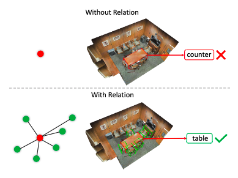

# 3DRM:  Pair-wise Relation Module for 3D Object Detection

## Introduction

3DRM is a plug-and-play module which can be applied to different 3D detection frameworks to detect 3D objects more accurately and robustly. We implement two applications on proposal-based methods and vote-based methods: OSegNet  (Proposal generation based on over-segmentation and backbones based on PointCNN) and VoteNet. OSegNet is trained and evaluated on S3DIS dataset, and VoteNet is trained and evaluated on ScanNetV2 and SUN RGB-D dataset. 

## Usage
3DRM can be widely applicable on different 3D detection frameworks. For further information about our implemention on two frameworks, please refer to the sub-directories: [OSegNet-RM](./OSegNet-RM) and [VoteNet-RM](./VoteNet-RM).

## Acknowledgemets
This code largely benefits from excellent works [PointCNN](https://github.com/yangyanli/PointCNN) and [VoteNet](https://github.com/facebookresearch/votenet) and repositories, please also consider cite [PointCNN](https://arxiv.org/abs/1801.07791.pdf) and [VoteNet](https://arxiv.org/pdf/1904.09664.pdf) and  if you use this code.